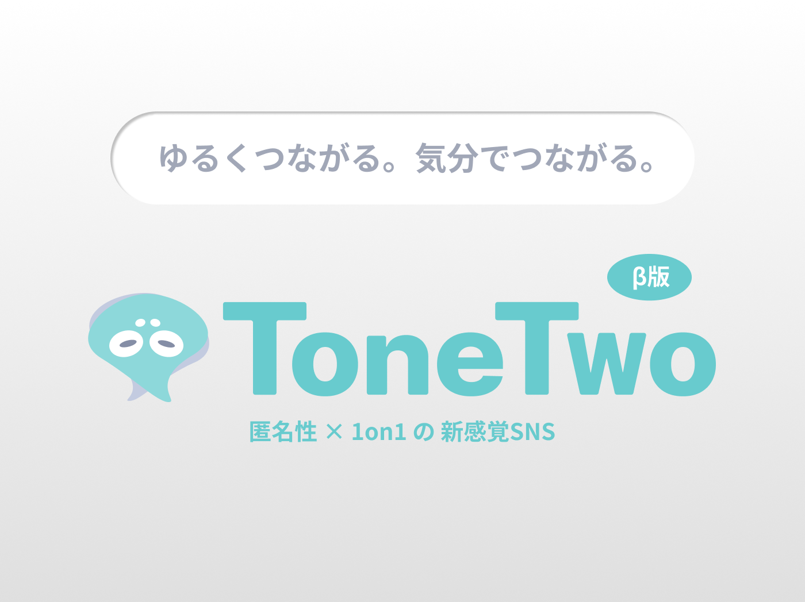

## Hello🐙World！
はじめまして、イワサキユカです。

`Ruby on Rails`を中心にWebアプリ開発に取り組んでいます。  

特にフロントエンド実装とUI/UXに関心があり、  
ユーザーが直感的に使える画面設計や体験づくりを意識して個人開発を進めています。

### Achievements & Qualifications

- Battle of RUNTEQ 新人賞 受賞 > [torisetsu_me](https://github.com/Iwasaki-Y0125/torisetsu_me)
- 応用情報技術者試験 合格

<table>
  <tr>
    <td>
      
    </td>
    <td>
      
    </td>
    <td>
      
    </td>
  </tr>
</table>

### Learning Languages & Tools

